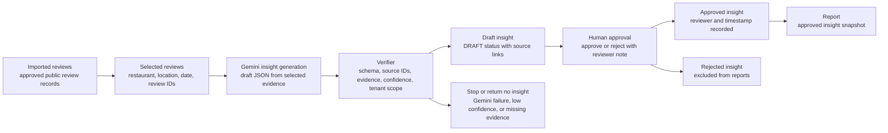

# Session 19 Workflow Diagram

## Review Insight Workflow

## Control Notes

- The verifier step is a control step in the documented workflow. In the current code path, controls include JSON schema validation, selected-review ID checks, source evidence links, confidence handling, tenant-scoped queries, and human review.
- Gemini generation is limited to selected imported reviews and should not produce competitor analysis or report narratives in this step.
- Draft and rejected insights do not enter report snapshots.
- Approved insights enter reports only after a human decision is recorded.
